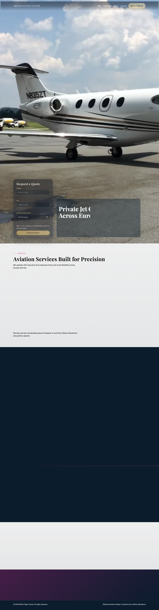
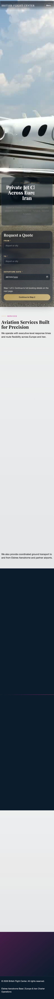

# British Flight Center v1 (Static Site)

## Files
- `index.html` homepage
- `fleet.html` fleet page
- `contact.html` contact page
- `assets/css/` tokenized styling and animation layers
- `assets/js/site.js` nav, reveal effects, validation, and form submission
- `assets/media/` placeholder visuals for hero/fleet

## Form Endpoint Setup
1. Open `assets/js/site.js`
2. Replace `FORM_ENDPOINT` with your Formspree/Web3Forms endpoint

## Hero Video Setup
- Add files:
  - `assets/media/hero-loop.webm`
  - `assets/media/hero-loop-small.mp4`
- Keep the poster fallback at `assets/media/hero-poster.jpg` (or replace with your image)

## Homepage Screenshots
Captured from:
- `http://127.0.0.1:5173/index.html`

Desktop:

Mobile:

## Placeholder Media Sources (Free)
- Video: [Coverr](https://coverr.co/videos/private-jets-at-an-airport-c9QWX5kH4L)
- Fleet image 1: [Pexels](https://www.pexels.com/photo/private-jet-at-sunset-on-runway-28772726/)
- Fleet image 2: [Pexels](https://www.pexels.com/photo/aircraft-under-blue-sky-28321097/)

## cPanel Deployment
Upload all files/folders to your domain document root (`public_html` or equivalent).
